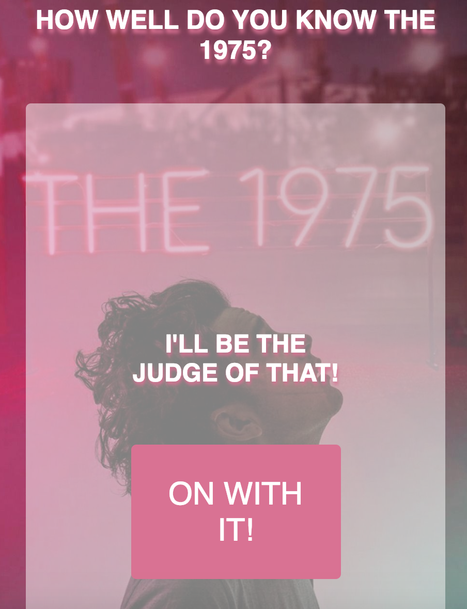
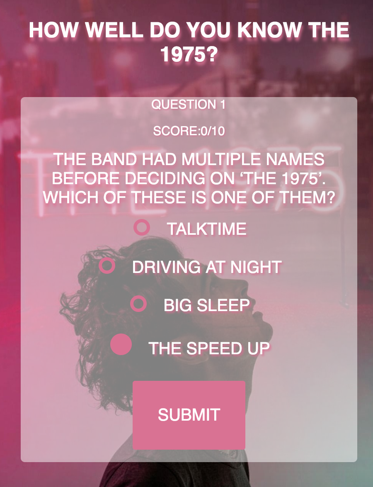
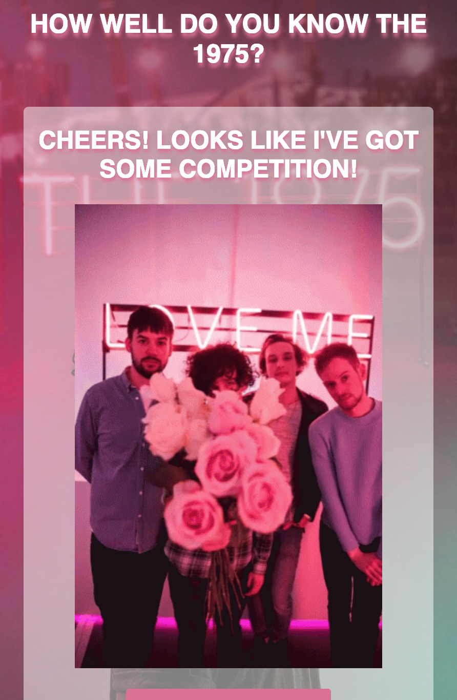
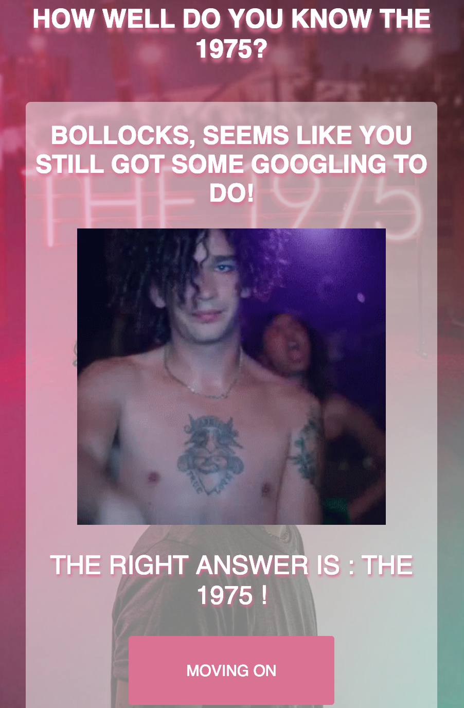
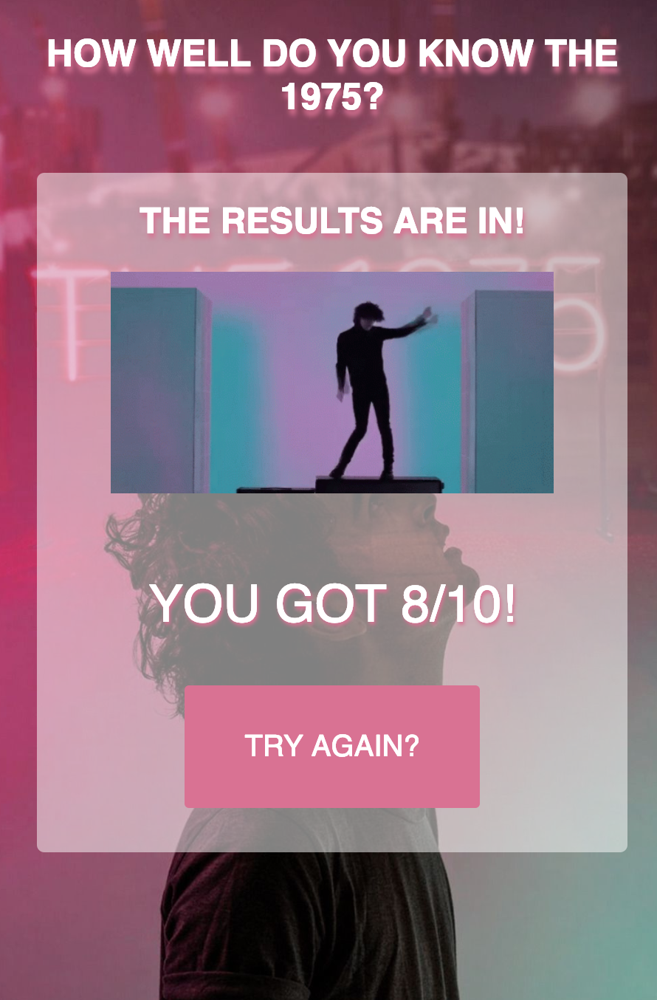

# The 1975 Quiz App

Live app can be viewed here: <a href="https://bahitssara.github.io/QUIZAPP/" target="_blank">Live App</a>

## Motivation
This app is a way for me to celebrate my favorite band! It was not only a great learning process as this was my first time using jQuery to create a dynamic page, but also a fun way to help my friends learn to love them along with me. 

## Screenshots

### Start Screen

### Question Pages

### Question Results
 

### Final Score Page

## Summary
This quiz app allows users to move one by one through a data set of 10 questions and answer sets about the 1975. As they work through each question they will recieve an immediate response if the answer is right or wrong. Wrong answers show the user what the correct answer is. The score is counted throughout the quiz to allow the user to see how well they've done. Once all questions are answered the results page gives a final score and allows the user to return to the start page to retake!   

## Built With
    -HTML
    -JavaScript
    -CSS
    -jQuery
